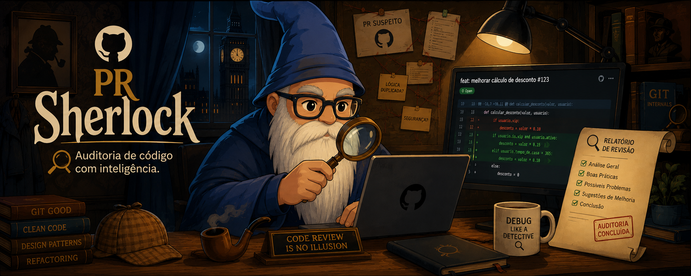

<p align="center">
  
</p>

# Sherlock

Projeto para revisar Pull Requests do GitHub de **projetos Django** com apoio do Claude Code. Cole o link de um PR e receba uma auditoria independente do código. Os achados são publicados como uma review no próprio PR do GitHub.

## Como funciona

O fluxo de revisão (documentado em detalhe em [`CLAUDE.md`](./CLAUDE.md)) segue estes passos:

1. **Coleta dos dados do PR** via `gh` CLI (`gh pr view`, `gh pr diff`, thread de comentários, issue vinculada, e `gh pr checkout` quando é preciso rodar testes ou navegar o repo completo).
2. **Código vs. descrição**: tudo o que o diff muda precisa estar descrito no PR, e tudo o que o PR promete precisa estar no código.
3. **Documentação na versão do PR**: `README.md`, `CLAUDE.md`, `AGENTS.md`, `docs/` etc. são lidos no head do PR para verificar se continuam verdadeiros depois da mudança, inclusive os que o PR não tocou.
4. **Auditoria a fundo do código** (não só o diff, mas o código ao redor), verificando regressão, queda de qualidade, código morto, duplicação, valores mágicos hardcoded, cobertura de testes e convenções Django/DRF.
5. **Confronto com a thread de comentários**: pontos já levantados no PR não são repetidos, e o que foi dado como corrigido mas continua no código volta como achado, com o link da thread original.
6. **Escrita dos achados** por severidade (crítico, importante, menor), com a prosa revisada pelo skill `humanizer` sem perder o markdown.
7. **Publicação no GitHub**, após confirmação, como uma única review do tipo `COMMENT`: comentários inline nas linhas do diff e, no corpo da review, os achados fora do diff.

Não há veredito nem arquivo de relatório: a saída são apenas os achados.

O princípio central: **a descrição do autor do PR nunca é levada como verdade**. Título, descrição e comentários são hipóteses a verificar contra o diff e o código real.

## Estrutura do projeto

```
.
├── CLAUDE.md          # instruções completas do processo de revisão (fonte da verdade)
├── README.md          # este arquivo
├── LICENSE             # licença MIT
├── .github/assets/     # imagens usadas na documentação (ex.: banner)
├── skills-lock.json   # skills instaladas via Claude Code
├── .agents/skills/     # arquivos das skills instaladas
└── .claude/skills/     # symlinks para .agents/skills/, carregados pelo Claude Code
```

## Skills de apoio

Instaladas em `.claude/skills/`, disponíveis para reforçar a auditoria mas **não substituem** o processo acima. Nenhuma delas busca o PR nem publica a review sozinha:

| Skill | Uso |
|---|---|
| `code-review` | Revisão em dois eixos (Standards/Spec) de um diff `git` local |
| `requesting-code-review` | Despacha um subagente revisor com contexto isolado (Critical/Important/Minor) |
| `django-reviewer` | Revisão de mudanças Django/Python (clareza, ORM/DRF, manutenibilidade) — núcleo da auditoria do Sherlock |
| `django-expert` | Boas práticas de backend Django |
| `django-safe-migration` | Segurança de migrations Django/PostgreSQL sem downtime |
| `django-celery-expert` | Tasks assíncronas com Celery em Django |
| `cdrf-expert` | Class-based views do Django REST Framework (Classy DRF) |
| `humanizer` | Remove marcas de texto gerado por IA da prosa dos achados, preservando o markdown da review |

## Uso

Basta colar o link de um PR do GitHub na conversa com o Claude Code neste diretório. Os achados aparecem primeiro no chat e, depois da sua confirmação, são publicados como review no PR. A conta autenticada no `gh` precisa ter acesso de leitura ao repositório para comentar.

> **Atenção:** o checkout do repositório sendo revisado deve ser feito fora deste diretório (ex.: `/tmp` ou um worktree) — este diretório é apenas o projeto de revisão, não o repositório revisado.

## Licença

Distribuído sob a licença [MIT](./LICENSE).
